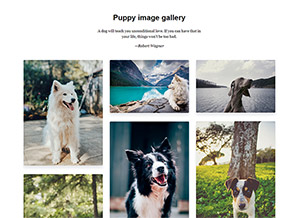

# Asana Dog Gallery

[](http://mbrownca.com/work/asana/dogs.html)

[View Demo](http://mbrownca.com/work/asana/dogs.html)

[Github](https://github.com/mbrownca/asana)

The responsive web page uses only vanilla javascript, HTML, and CSS.

Though the test zip folder didn't seem to have a sketch or PSD file in it, (so I wasn't sure how the final page should look), the code uses the provided header and footer snippets as well as the style sheet. 

### Usage ###
Download the library and include [dogsscript.js](https://github.com/mbrownca/asana/blob/master/assets/data/dogscripts.js) and [site.css](https://github.com/mbrownca/asana/blob/master/assets/styles/site.css) in your HTML.

The script fetches each image and source URL from the JSON file and appends them to a div.
```html
fetch('assets/data/dogs.json')
	.then(response => {
		return response.json()
	})
	.then(data => {

		for (var i = 0; i < data.dogs.length; i++) {
			var elem = document.createElement("img");
			var doglist = document.getElementById("dog-list");
			elem.src = "." + data.dogs[i].image;
			elem.onclick = open_click;
						     
			var index = (i + 1);
			doglist.appendChild(elem).setAttribute("id", "dogimg-" + index);
			document.getElementById("dogimg-" + index).classList.add(index);
		}
	})
```

Lazy image loading script which switches the local image with the data-src is commented out from the JS file because of a CORS restriction from the data-source unsplash.

An event listener detects a click on the image within the gallery to display an overlay background and larger version of that same image.

I used some hover transitions for the gallery.
```html
	.tile img:hover {
		box-shadow: 0 30px 30px 0 rgba(36, 50, 66, .5);
		filter: brightness(80%);
		-webkit-transition: all .3s ease-in-out;
		-moz-transition: all .3s ease-in-out;
		transition: all .3s ease-in-out;
		cursor: pointer;
	}
```

The code uses settimeout to control the appearance of the overlay and larger image.
```html
	setTimeout(function () {
		dogoverlay.style.opacity = 1;
	}, 100);
```

An XMLHttpRequest pulls the header and footer into the page.
